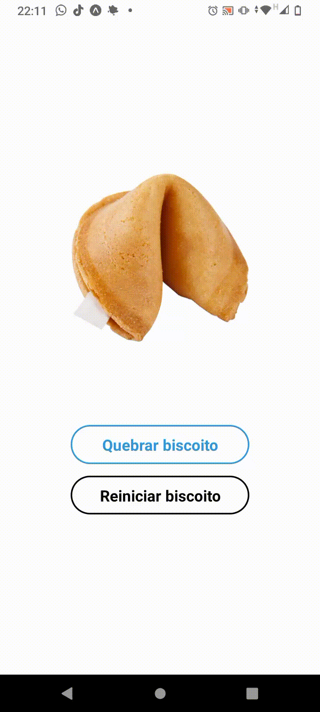

# Biscoito da Sorte - React Native

O Biscoito da Sorte é um aplicativo mobile desenvolvido com React Native que simula a experiência de abrir um biscoito da sorte e exibir uma frase inspiradora aleatória para o usuário. O objetivo deste projeto é explorar conceitos básicos de desenvolvimento com React Native e criar uma aplicação divertida e interativa.

## **Funcionalidades**

- Exibição de um biscoito fechado na tela principal;
- Ao clicar no botão "Quebrar biscoito", o biscoito é aberto e uma frase aleatória é exibida na tela;
- O usuário pode reiniciar o biscoito clicando no botão "Reiniciar biscoito".

## **Como executar o projeto**

Para executar o projeto em sua máquina local, siga os seguintes passos:

1. Clone o repositório em sua máquina:

```

git clone https://github.com/seu-usuario/biscoito-da-sorte-react-native.git

```

1. Instale as dependências do projeto:

```

cd biscoito-da-sorte-react-native
npm install

```

1. Inicie o servidor Metro do React Native:

```

npx react-native start

```

1. Inicie o aplicativo no emulador ou dispositivo conectado:

```

npx react-native run-android

```

ou

```

npx react-native run-ios

```

## **Tecnologias utilizadas**

- **[React Native](https://reactnative.dev/)**
- **[Expo](https://expo.io/)**
- **[JavaScript](https://developer.mozilla.org/pt-BR/docs/Web/JavaScript)**

## **Neste código foram utilizados os seguintes conceitos do React Native:**

1. Componentes: O código cria vários componentes, como a imagem do biscoito, o texto da frase, os botões, entre outros, para compor a interface do aplicativo.

2. Estado (State): O código utiliza o hook useState para criar variáveis de estado, como image e textoFrase, que são atualizadas e refletem as mudanças na interface.

3. Eventos: O código utiliza a propriedade onPress para adicionar eventos aos botões, que disparam as funções abrirBiscoito e reiniciarBiscoito.

4. Estilos: O código utiliza a propriedade style para aplicar estilos aos componentes, como cor, tamanho, borda, entre outros.

5. Manipulação de dados: O código utiliza uma lista de frases que é selecionada aleatoriamente pela função abrirBiscoito e exibida no texto da frase.


## **Amostra**



## **Autor**

<a href="https://github.com/Francielefernandes06">
 
 <br />
 <sub><b>Franciele Fernandes</b></sub></a> <a href="https://github.com/Francielefernandes06" title="GitHub">☕</a>


Feito com ❤️ por Franciele Fernandes 👋🏽 Entre em contato!

<a href="https://instagram.com/franciele_fernandes06" target="_blank"></a>
<a href = "mailto:francielefernandes126@gmail.com"></a>
 <a href="https://www.linkedin.com/in/franciele-fernandes-92556b1a7/" target="_blank"></a> 
 <a href="https://wa.me/5584994285704?text=Olá,%20Franciele%20Fernandes.%20Tudo%20bem?" target="_blank"></a>
